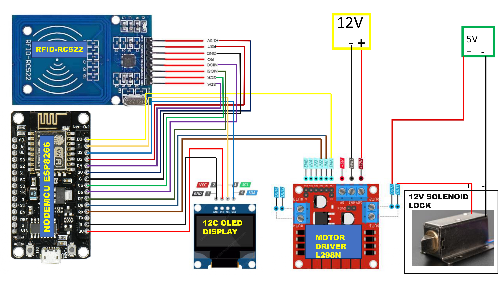

# 🚪 ESP8266 RFID Access Control System with Telegram Alerts & Web Interface

A smart, Wi-Fi-enabled door access system built using **ESP8266**, **RFID**, **L298N motor driver**, **OLED Display**, and **Telegram bot integration**. Authorized users can unlock the door by scanning an RFID card or using a secure web interface. All access attempts are logged and notified via Telegram.

---

## 🔧 Features

- ✅ RFID-based secure authentication
- 🌐 Web interface to remotely unlock door
- 📩 Real-time Telegram notifications
- 🖥 OLED display feedback (Access Granted/Denied)
- 🔁 Motor control via L298N for lock mechanism
- 🔒 Unauthorized access alerts
- 📡 Wi-Fi enabled and OTA-capable

---
🎥 [Click here to download or view demo video](https://drive.google.com/file/d/1mZy1aYN8QZInOovXf1yhzZags61BjSnt/view?usp=sharing)

## 🚀 Getting Started

1. Clone the repository
2. Open `ESP8266.ino` in Arduino IDE
3. Install required libraries:
   - `ESP8266WiFi`
   - `MFRC522`
   - `ESPAsyncWebServer`
   - `Adafruit_SSD1306`
   - `ESP8266WebServer`
   - `Adafruit GFX Library`
4. Update your Wi-Fi credentials, Telegram Bot Token, and Chat ID in code
5. Upload to ESP8266 and test!

## 📲 Telegram Bot Setup

1. Create a new bot using [BotFather](https://t.me/botfather).
2. Save the **Bot Token**.
3. Start a chat with your bot and send a message.
4. Use [@userinfobot](https://t.me/userinfobot) to get your **chat ID**.
5. Replace the placeholders in the code:
   ```cpp
   String botToken = "<your_bot_token>";
   String chatId = "<your_chat_id>";

## 🛠️ Hardware Components

| Component             | Quantity |
|-----------------------|----------|
| ESP8266 NodeMCU       | 1        |
| RC522 RFID Reader     | 1        |
| L298N Motor Driver    | 1        |
| Solenoid Lock        | 1        |
| OLED Display (SSD1306)| 1        |
| 12V Battery Pack      | 1        |
| 5V Battery Pack      | 1        |
| Connecting Wires      | As needed |

---

## 🔌 Hardware Connections


### 📟 **L298N Motor Driver → ESP8266**
| L298N Pin | ESP8266 Pin |
|-----------|-------------|
| ENA       | D0          |
| IN1       | D8          |
| IN2       | RX (GPIO3)  |
| OUT1      | +VE SOLENOID|
| OUT2      | +VE 5V Battery |
| 12V       | 12V Battery +   |
| GND       | 12V Battery –   |

---
| -VE OF 5V BATTERY  | -VE OF SOLENOID  |
|-----------|-----------------------|

---

### 🖥 **OLED Display (SSD1306) → ESP8266**
| OLED Pin | ESP8266 Pin |
|----------|-------------|
| SDA      | D2          |
| SCL/SCK     | D1          |
| VDD      | 3V          |
| GND      | GND         |

---

### 📡 **RC522 RFID Reader → ESP8266**
| RFID Pin | ESP8266 Pin |
|----------|-------------|
| SDA      | D4          |
| SCL/SCK      | D5          |
| MOSI     | D7          |
| MISO     | D6          |
| RST      | D3          |
| 3.3V     | 3V          |
| GND      | GND         |

---

## 🧠 How It Works

1. RFID card is scanned.
2. UID is checked against authorized list.
3. If authorized:
   - Motor is activated (door unlocks).
   - OLED shows **Access Granted**.
   - Telegram notification is sent.
4. If unauthorized:
   - OLED shows **Access Denied**.
   - Telegram alert is sent.
5. Optionally, the door can be unlocked via web interface hosted on ESP8266.
   you can access web interface via                  
   `http://<esp-ip>:80`

---
## 👨‍💻 Contributors

| Name        | GitHub Profile                          | Role/Contribution                        |
|-------------|------------------------------------------|-------------------------------------------|
| Vaibhav Sharma       | [@vaibhav2195](https://github.com/vaibhav2195) | Hardware Integration & Developer, Telegram API   |
| Devansh Singh       | [@Deva3664](https://github.com/Deva3664) |Hardware & Enclosure Designer, project demo & presentation |
| Krishnav Talukdar | [@CYBERCONQUEROR](https://github.com/CYBERCONQUEROR) |  Web Integration, project demo & presentation       |
| Aryan Patel       | [@Alexa88879](https://github.com/Alexa88879) | Hardware Integration & Developer, Documentation Lead  |

---
## 🤝 Contributing
Contributions are welcome! Please feel free to submit a Pull Request.
### Steps to Contribute:

1. **Fork the project**  
   Click the "Fork" button on the top right of the repository to create a copy of the project under your GitHub account.

2. **Create your feature branch**  
   ```bash
   git checkout -b feature/AmazingFeature
3. **Commit your changes**
   ```bash
   git commit -m 'Add some AmazingFeature'
6. **Push to the branch**
   ```bash
   git push origin feature/AmazingFeature
7. **Open a Pull Request**
---
## 📧 Contact
For any questions or feedback, please reach out through:
- **GitHub Issues**: [Create an issue](https://github.com/Alexa88879/ESP8266-RFID-Telegram-Door-Lock/issues)

